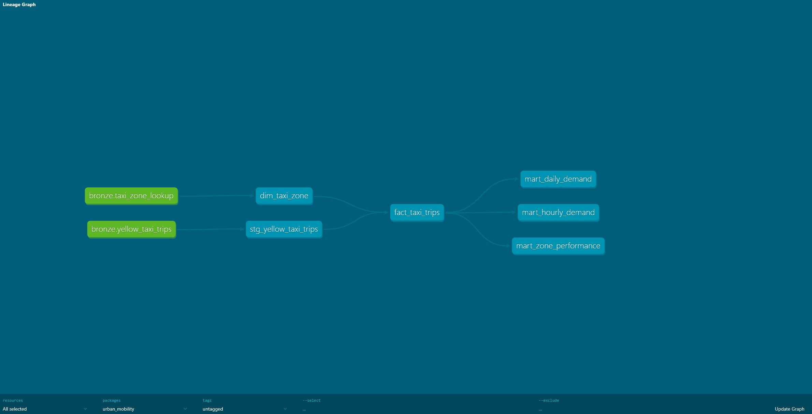
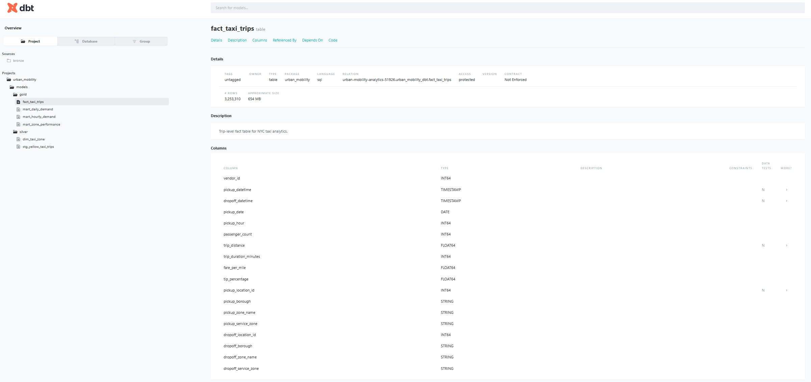

# Urban Mobility Analytics Platform

An end-to-end analytics engineering project built using NYC Taxi trip data and a modern medallion architecture on Google Cloud Platform.

This project demonstrates cloud data ingestion, warehouse modeling, dbt transformation workflows, dimensional analytics engineering, and Power BI dashboard development using modern analytics engineering practices.

---

# Project Architecture

```text
NYC TLC Parquet Files
        ↓
Python Ingestion Scripts
        ↓
Google Cloud Storage (Bronze)
        ↓
BigQuery External Tables
        ↓
dbt Silver Models
        ↓
dbt Gold Fact Tables & Marts
        ↓
Power BI Dashboard
```

---

# Medallion Architecture

## Bronze Layer

Raw NYC Taxi parquet and CSV files stored in Google Cloud Storage and exposed through BigQuery external tables.

### Bronze Tables
- yellow_taxi_trips
- taxi_zone_lookup

---

## Silver Layer

Cleaned and standardized datasets with derived business metrics and dimensional enrichment.

### Silver Models
- stg_yellow_taxi_trips
- dim_taxi_zone

### Silver Transformations
- trip duration calculations
- fare per mile calculations
- tip percentage calculations
- temporal enrichment
- data quality filtering

---

## Gold Layer

Business-ready analytics models optimized for reporting and dashboard consumption.

### Gold Models
- fact_taxi_trips
- mart_daily_demand
- mart_hourly_demand
- mart_zone_performance

---

# Tech Stack

| Layer | Technology |
|---|---|
| Language | Python |
| Cloud Platform | Google Cloud Platform |
| Cloud Storage | Google Cloud Storage |
| Data Warehouse | BigQuery |
| Transformation Framework | dbt |
| Data Processing | SQL |
| Visualization | Power BI |
| Version Control | Git & GitHub |
| Architecture Pattern | Medallion Architecture |

---

# Pipeline Workflow

```text
Download NYC Taxi Data
        ↓
Store Raw Files in GCS
        ↓
Create Bronze External Tables
        ↓
Build Silver dbt Models
        ↓
Build Gold Fact Tables & Marts
        ↓
Validate with dbt Tests
        ↓
Visualize in Power BI
```

---

# dbt Lineage



---

# dbt Model Documentation



---

# Dashboard Screenshots

## Executive Overview


---

## Demand Analysis


---

## Zone Performance


---

## Trip Behavior & Revenue Analysis


---

# Key Features

- End-to-end cloud analytics engineering pipeline
- Medallion architecture implementation
- BigQuery warehouse modeling
- dbt modular transformations
- dbt lineage and dependency management
- dbt testing framework
- Dimensional analytics modeling
- Gold reporting marts
- Interactive Power BI dashboards
- Source-controlled SQL transformations

---

# Data Models

## Bronze

### yellow_taxi_trips
Raw NYC taxi trip parquet data.

### taxi_zone_lookup
Taxi zone dimension lookup data.

---

## Silver

### stg_yellow_taxi_trips
Cleaned and standardized trip data with derived metrics.

### dim_taxi_zone
Taxi zone dimension table.

---

## Gold

### fact_taxi_trips
Trip-level fact table enriched with pickup and dropoff zone information.

### mart_daily_demand
Daily trip demand and revenue metrics by borough.

### mart_hourly_demand
Hourly trip demand analysis by borough.

### mart_zone_performance
Zone-level operational and revenue performance metrics.

---

# dbt Testing

Implemented dbt tests for:
- not_null validations
- warehouse integrity checks
- model validation

---

# Future Enhancements

- Apache Airflow orchestration
- Incremental dbt models
- CI/CD pipeline integration
- Automated data quality monitoring
- PySpark transformation layer
- Terraform infrastructure-as-code
- Real-time streaming ingestion
- Advanced geospatial analytics

---

# Dataset Source

NYC Taxi & Limousine Commission (TLC) Trip Record Data

https://www.nyc.gov/site/tlc/about/tlc-trip-record-data.page

---

# Repository Structure

```text
urban-mobility-analytics-platform/
│
├── dashboards/
│   └── powerbi/
│       └── screenshots/
│
├── data/
│
├── dbt/
│   └── urban_mobility/
│       └── models/
│           ├── silver/
│           └── gold/
│
├── docs/
│   └── screenshots/
│
├── scripts/
│
├── sql/
│   ├── silver/
│   └── gold/
│
├── requirements.txt
└── README.md
```

