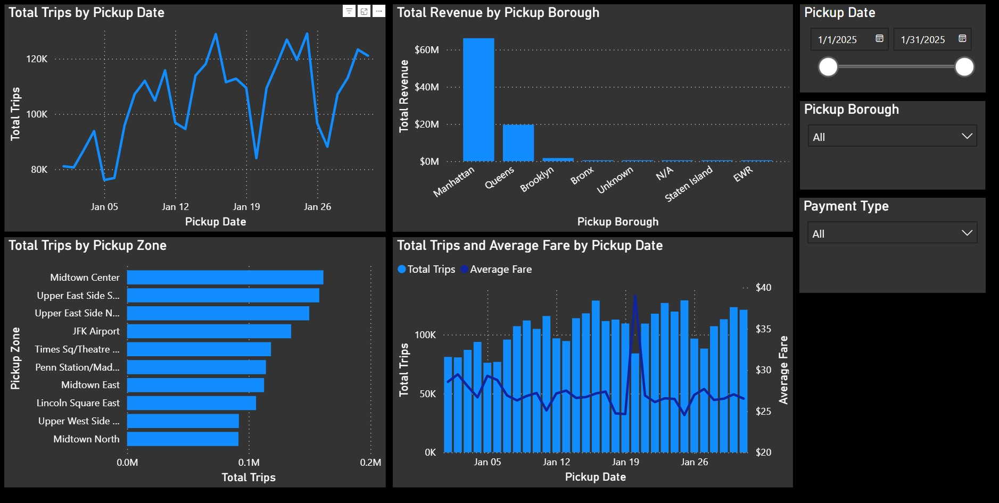
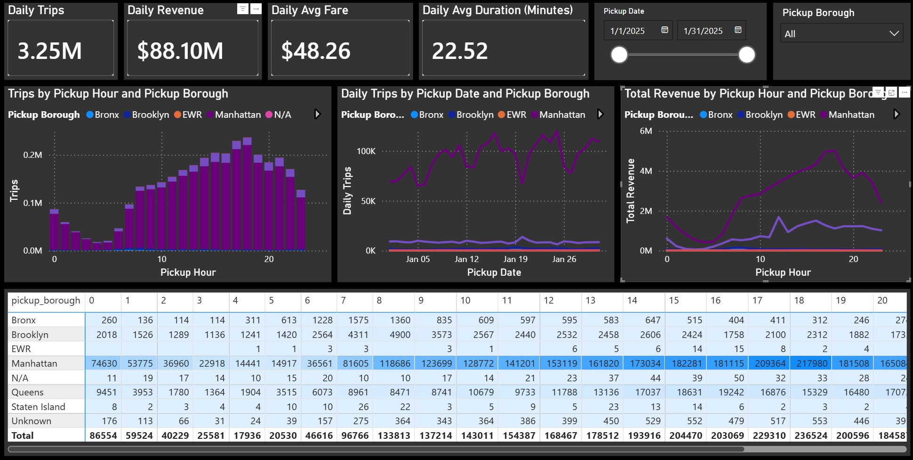
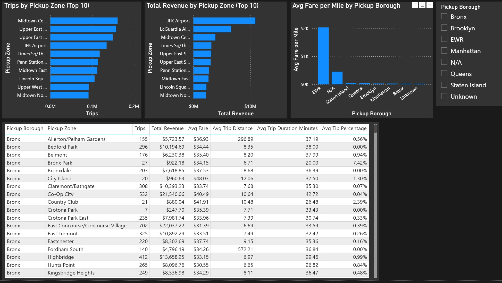
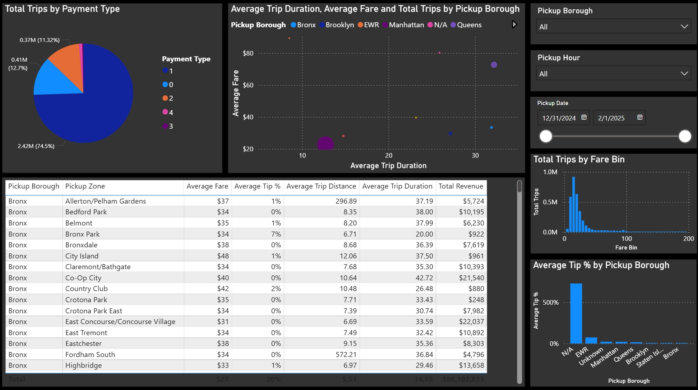

# Urban Mobility Analytics Platform

An end-to-end analytics engineering project built using NYC Taxi trip data and a medallion data architecture on Google Cloud Platform.

This project demonstrates cloud data ingestion, warehouse modeling, medallion architecture design, dimensional analytics engineering, and Power BI dashboard development using modern data tooling.

---

## Project Architecture

```text
NYC TLC Parquet Files
        ↓
Bronze Layer (Raw)
    Google Cloud Storage
    BigQuery External Tables
        ↓
Silver Layer (Cleaned & Conformed)
    BigQuery Transformations
        ↓
Gold Layer (Analytics Marts)
    Fact Tables
    Aggregated Reporting Tables
        ↓
Power BI Dashboard
```

---

## Medallion Architecture

### Bronze Layer
Raw NYC Taxi parquet files stored in Google Cloud Storage and exposed through BigQuery external tables.

### Silver Layer
Cleaned and standardized trip data with derived metrics:
- trip duration
- fare per mile
- tip percentage
- temporal attributes

### Gold Layer
Business-ready analytics models and reporting marts:
- fact_taxi_trips
- mart_daily_demand
- mart_hourly_demand
- mart_zone_performance

---

## Tech Stack

| Layer | Technology |
|---|---|
| Language | Python |
| Cloud Storage | Google Cloud Storage |
| Data Warehouse | BigQuery |
| Data Processing | SQL |
| Orchestration | Planned: Airflow |
| Analytics Engineering | Planned: dbt |
| Visualization | Power BI |
| Version Control | Git & GitHub |

---

## Pipeline Workflow

```text
Download NYC Taxi Data
        ↓
Store Raw Files in GCS
        ↓
Create Bronze External Tables
        ↓
Transform Data into Silver Layer
        ↓
Build Gold Fact Tables & Marts
        ↓
Visualize in Power BI
```

---

## Data Models

### Bronze
- yellow_taxi_trips
- taxi_zone_lookup

### Silver
- yellow_taxi_trips_cleaned
- dim_taxi_zone

### Gold
- fact_taxi_trips
- mart_daily_demand
- mart_hourly_demand
- mart_zone_performance

---

## Dashboard Screenshots

### Executive Overview



### Demand Analysis



### Zone Performance



### Trip Behavior & Revenue Analysis



---

## Key Features

- Medallion architecture implementation
- Cloud-native storage and querying
- Partitioned BigQuery tables
- Dimensional analytics modeling
- Aggregated reporting marts
- Interactive Power BI dashboards
- SQL-based transformation workflows

---

## Future Enhancements

- dbt migration
- Airflow orchestration
- PySpark transformation layer
- Automated data quality checks
- CI/CD pipeline integration
- Incremental loading strategy

---

## Dataset Source

NYC Taxi & Limousine Commission (TLC) Trip Record Data

https://www.nyc.gov/site/tlc/about/tlc-trip-record-data.page

